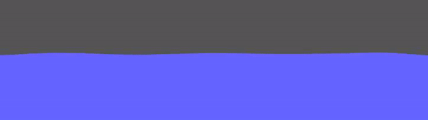

# PaperJS Water Physics
Simple water physics demo in the paperjs framework.

## Setup
- Clone project
- Npm install
- Npm run dev

## Interaction
- Click on the water to splash
- Press space for a bigger splash

## About
Project was setup for research purposes and out of interest for making a very basic water looking effect.

## WIP
- Tweak forces to simulate more realistic
- Make demo with physical objects colliding with water
